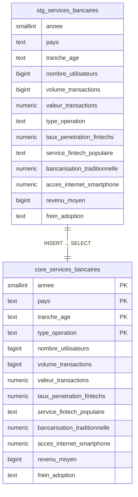

# Services Bancaires -- Mini-pipeline ELT
======================================

> **Objectif :** importer régulièrement un CSV (« services_bancaires ») dans PostgreSQL, le nettoyer / dédoublonner et le rendre prêt pour l'analyse.


## 1 Structure du dépôt
--------------------

```plaintext
services-bancaires-elt/
├── data/
│   └── raw/                  # CSV copiés par extract.py
├── scripts/
│   ├── extract.py            # copie/télécharge le CSV
│   ├── load.py               # COPY → stg
│   ├── transform.py          # INSERT → core
│   └── run_pipeline.py       # orchestre E→L→T
├── sql/
│   ├── 01_create_tables.sql  # schémas + tables
│   └── 02_transform.sql      # nettoyage/dédoublonnage
├── .env                      # variables PG
├── requirements.txt          # dépendances pip
└── README.md                 # ce fichier
```


## 2 Prérequis
-----------

-   PostgreSQL ≥ 14 installé en local (port 5432)

-   Python 3.9 +

-   Un environnement virtuel :

`python3 -m venv .venv
source .venv/bin/activate
pip install -r requirements.txt`

-   Fichier **.env** à la racine :

```plaintext
PGHOST=localhost
PGPORT=5432
PGDATABASE=elt_proj
PGUSER=$USER           # ou un autre rôle
PGPASSWORD=...       # si besoin
```


## 3 Initialisation des tables (une seule fois)
--------------------------------------------

`psql -d elt_proj -f sql/01_create_tables.sql`


## 4 Lancer la pipeline manuellement
---------------------------------

`source .venv/bin/activate
python scripts/run_pipeline.py      # extract → load → transform`

### Vérification rapide

`SELECT COUNT(*) FROM stg.services_bancaires;
SELECT COUNT(*) FROM core.services_bancaires;`


## 5 Schéma relationnel BDD (Mermaid)
--------------------




## 6 Schéma du pipeline (Mermaid)
--------------------


## 7 Licence
----------

*MIT* --- utilisation libre.
